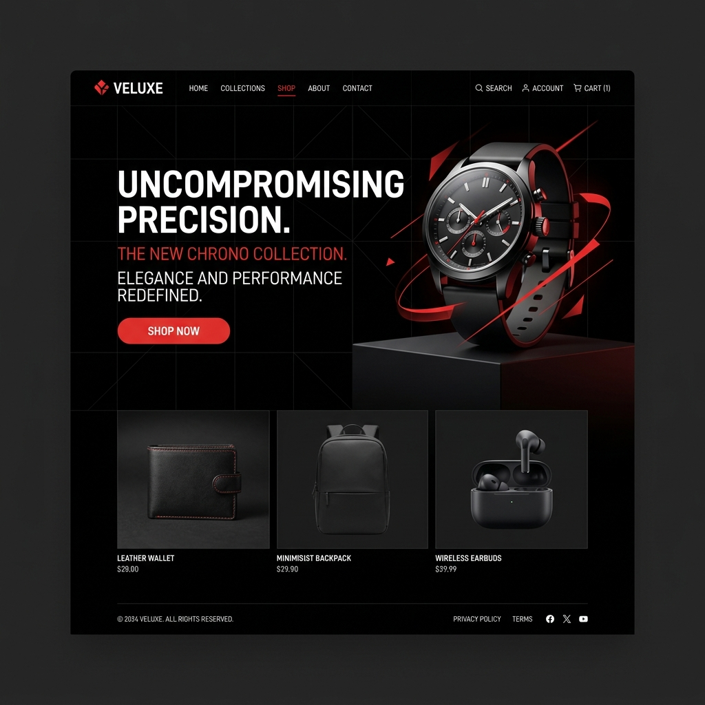

# 🔴 Portfolio — Creative Developer

A premium dark-themed developer portfolio website inspired by [stabondar.com](https://www.stabondar.com/), featuring Three.js particle backgrounds, GSAP scroll-triggered animations, and a horizontal project showcase.



## ✨ Features

- **Three.js Particle Background** — 1500 interactive particles with mouse-reactive rotation
- **GSAP Scroll Animations** — Smooth reveals, counters, and parallax effects via ScrollTrigger
- **Horizontal Project Scroll** — Pinned horizontal carousel for project showcase
- **Custom Cursor** — Red accent dot with hover scaling
- **Loading Animation** — Glitch text effect with progress counter
- **Full-Screen Menu** — Clip-path animated overlay with staggered links
- **Lenis Smooth Scroll** — Buttery smooth scrolling experience
- **Responsive Design** — Mobile-first approach with breakpoints at 768px and 1024px

## 🎨 Design System

| Token | Value |
|-------|-------|
| Accent Color | `#EB4330` |
| Background | `#000000`, `#111111` |
| Font | NeueMachina / Space Grotesk |
| Weights | 300 (display), 400 (body) |
| Spacing | 4px base unit |
| Border Radius | 4px (standard), 1440px (pills) |

## 📁 Project Structure

```
├── index.html              # Homepage
├── cases.html              # Projects grid
├── contact.html            # Contact form
├── css/
│   ├── base.css            # Design system, variables, reset
│   ├── layout.css          # Grid & responsive
│   ├── components.css      # UI components
│   ├── animations.css      # Keyframes & transitions
│   └── pages.css           # Page-specific styles
├── js/
│   ├── app.js              # Entry point + Lenis
│   ├── loader.js           # Loading animation
│   ├── cursor.js           # Custom cursor
│   ├── navigation.js       # Menu overlay
│   ├── three-scene.js      # Three.js particles
│   ├── scroll-animations.js # ScrollTrigger animations
│   └── horizontal-scroll.js # Horizontal carousel
└── assets/images/          # Project images
```

## 🚀 Getting Started

### Run Locally

```bash
# Clone the repository
git clone https://github.com/YOUR_USERNAME/stabondar-portfolio.git
cd stabondar-portfolio

# Start a local server
python3 -m http.server 8080

# Or use any static server
npx serve .
```

Open [http://localhost:8080](http://localhost:8080) in your browser.

### Deploy

This is a static website — deploy to any static hosting:

- **GitHub Pages**: Enable in repo Settings → Pages
- **Vercel**: `npx vercel --prod`
- **Netlify**: Drag & drop the project folder

## 🛠 Tech Stack

| Technology | Purpose |
|------------|---------|
| HTML5 / CSS3 | Structure & styling |
| Vanilla JavaScript | Logic & interactivity |
| [GSAP 3](https://gsap.com/) | Animations & ScrollTrigger |
| [Three.js](https://threejs.org/) | 3D particle background |
| [Lenis](https://lenis.darkroom.engineering/) | Smooth scrolling |
| [Space Grotesk](https://fonts.google.com/specimen/Space+Grotesk) | Typography |

## 📝 Customization

1. **Name & Title** — Edit `hero__name` and `hero__role` in `index.html`
2. **Projects** — Replace images in `assets/images/` and update card text
3. **Social Links** — Update `href="#"` throughout all pages
4. **Colors** — Modify CSS variables in `css/base.css`
5. **Contact** — Update email in `contact.html`

## 📄 License

MIT License — see [LICENSE](LICENSE) for details.

---

<p align="center">
  Built with ❤️ and <span style="color: #EB4330;">GSAP + Three.js</span>
</p>
